* [ Shortalink ](#shortalink)

* [ Twitter Bots ](#twitter-bots)

* [ tldr pages browser extension ](#tldr-pages-browser-extension)

* [ Azure DevOps Bicep Tasks ](#azure-devops-bicep-tasks)

* [ dotnex ](#dotnex)

* [ guid-ts ](#guid-ts)

* [ kube-score check ](#kube-score-check)

* [ developer.li ](#developerli)

* [ WTransfer ](#wtransfer)

* [ Fiestas de Ejea ](#fiestas-de-ejea)

* [ Portfolio ](#portfolio)

* [ Adidas Assistant ](#adidas-assistant)

* [ © - graph ](#c-graph)

* [ Stock Surfer ](#stock-surfer)

* [ Stores for Me! ](#stores-for-me)

* [ Linked Data Hurricanes Info ](#linked-data-hurricanes-info)

* [ Process Mining for Security ](#process-mining-for-security)

* [ PocketShop ](#pocketShop)

* [ JajaTweets ](#jajaTweets)

* [ WallaLinks! ](#wallaLinks)

* [ WallaPet ](#wallapet)

-----------

## Shortalink

**Custom link shortener service using Cloudflare Workers + KV store one of my domains (privacy first focused)**

This project is privacy friendly, nothing but the URL and necessary data for rate limit are collected, and after a time discarded (except for the URL if it is fair usage).

This API is easily consumed programmatically, such as through shell functions, making it trivial to shorten links on the fly. It is console / cURL friendly.
The browser frontend is available in GitHub Pages in [https://go.shorta.link/](https://go.shorta.link/).

[View source code](https://github.com/piraces/shorta.link)
[View the project live in shorta.link](https://shorta.link/)

-----------

## Twitter Bots

**A series of Twitter bots with different purposes 👾**

- **Azure Updates Bot (@AzureUpdatesBot):** posts the latest Azure updates from the oficial Azure feed ([https://azure.microsoft.com/en-us/updates/](https://azure.microsoft.com/en-us/updates/)).

- **Short Bits! (@short_bits):** Short bits! are short infomation pills for tech people / geeks / nerds that will find them interersing. The information is extracted from [https://piraces.dev/short-bits/](https://piraces.dev/short-bits/).

[Azure Updates Bot (@AzureUpdatesBot)](https://twitter.com/AzureUpdatesBot)
[Short Bits! Bot (@short_bits)](https://twitter.com/short_bits)

-----------

## tldr pages browser extension

**📚 A browser extension for [tldr-pages](https://github.com/tldr-pages/tldr). Compatible with Chromium based browsers and Firefox.**

How it works:
- Highlight and right click a command (or right click a link) on your webpage and select "tldr-pages" in the dropdown a tooltip should appear with information fetched from the "tldr-pages" project (https://github.com/tldr-pages/tldr).

The extension is published in the official marketplaces for the following browsers:

- For Edge: [Microsoft Edge Add-ons](https://microsoftedge.microsoft.com/addons/detail/tldr-pages/hbplonhehblpcghgkhnjepdbohbpkoak)
- For Chrome: [in the Chrome Store](https://chrome.google.com/webstore/detail/tldr-pages/fcccijijdgmmcjnifgdhcmepnkcdingf).
- For Firefox: [Firefox Browser Add-ons](https://addons.mozilla.org/es/firefox/addon/tldr-pages/).

[View project](https://github.com/piraces/dotnex)

-----------

## Azure DevOps Bicep Tasks

**Azure DevOps set of tasks that allow to install and run Microsoft Bicep CLI commands**

This is a simple yet useful Azure DevOps set of tasks that allow to install and run [Microsoft Bicep CLI](https://github.com/Azure/bicep) commands in Azure Pipelines (cross-platform).

[View project](https://github.com/piraces/azure-devops-bicep-task/)
[**View in Marketplace**](https://marketplace.visualstudio.com/items?itemName=piraces.bicep-tasks)

-----------

## dotnex

**.NET tool to execute other dotnet tools without installing them globally or in a project**

A simple .NET tool to execute other dotnet tools without installing them globally or in a project (a similar approach to [npx](https://www.npmjs.com/package/npx) from [npm](https://www.npmjs.com/)).

**Note**: This project was previously named `dotnet-tool-run`, but it was renamed to simplify and provide a shorter name. You can see the older package [here](https://www.nuget.org/packages/dotnet-tool-run/).

[View project](https://github.com/piraces/dotnex)
[**View in Nuget.org**](https://www.nuget.org/packages/dotnex/)

-----------

## guid-ts

**Package for generating and managing globally unique identifiers (GUIDs) v4 in Typescript**

Package for generating and managing globally unique identifiers (GUIDs) v4 in Typescript.

Lightweight, simple, dependency free, and reliable package.

This package provides a class which can parse and generate a GUID based on the [RFC4122](https://www.ietf.org/rfc/rfc4122.txt).
The package also expose methods to manage GUIDs.

[View project](https://github.com/piraces/guid-ts)
[**View in npmjs.com**](https://www.npmjs.com/package/guid-ts)

-----------

## kube-score check

**Performing static code analysis of your Kubernetes object definitions with a Github Action**

GitHub Action that executes [kube-score](https://kube-score.com/) with selected manifests (with support for YAML, Helm or Kustomize manifests).

[View project](https://github.com/marketplace/actions/kube-score-check)

-----------

## developer.li

**Subdomains for free using the domain developer.li (built in Angular)**

Simple subdomain availability check web which helps you to configure a free subdomain in the developer.li domain (made with the NES.css awesome style).

[View project](https://developer.li/)

-----------

## WTransfer

**Telegram Bot built with AWS Lambda and WeTransfer API**

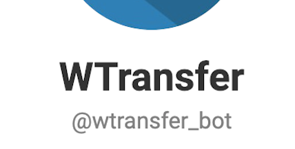

Bot built with Node.js in AWS which you can send files and it automatically uploads it to WeTransfer, to provide you a public link to download the file.

[View project](https://t.me/wtransfer_bot)

-----------

## Fiestas de Ejea

**Ionic (Angular), Firebase with CI/CD (bitrise.io)**

Festivities info app for my native region, incuding firebase integration. Developed with Ionic (angular). Available for Android and iOS.

[View project](https://github.com/piraces/fiestasEjea)

-----------

## Portfolio

**Angular, Typescript with CI/CD (Netlify & Travis CI)**

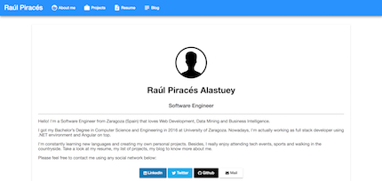

Angular portfolio made static for my personal page, hosted on github and managed by Netlify & Travis CI to perform CI/CD.

[View project](https://github.com/piraces/portfolio)

-----------

## Adidas Assistant

**Tensorflow + Python (for recognition), Node.js (backend), MongoDB (DB), Facebook API, Recast.AI**

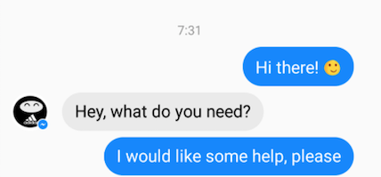

Facebook Bot that acts as an assistant. It is able to interpret human natural language, and perform different actions such as recognize Adidas' trainers.

[View project](https://github.com/Bozaneros/AdidasAssistant)

-----------

## c graph

**Javascript, HTML5, CSS3, SPARQL, Java Spark, Vis.js**

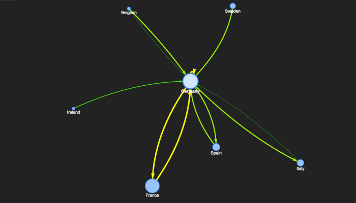

Tools related to the visualisation of copyright evidence and/or enhance the Copyright Wiki (copyrightevidence.org).

[View project](https://github.com/ismaro3/c-graph)

-----------

## Stock Surfer

**Javascript, Phaser (HTML5)**

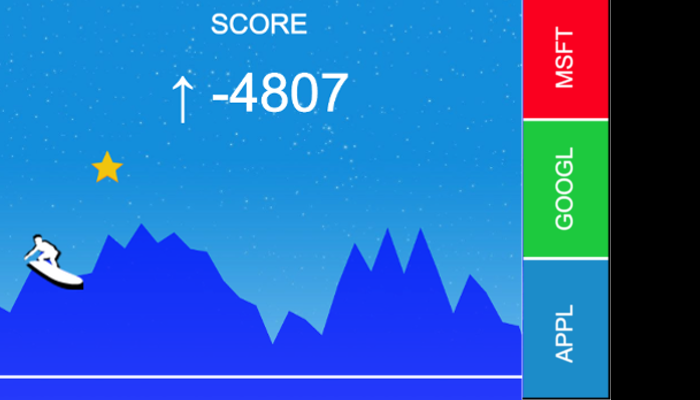

Mobile game where you have to surf the stock graphs of several enterprises and change among them to remain above of a minimum level (colecting bonuses).

[View project](https://github.com/albertomg994/Stock-Surfer)

-----------

## Stores for Me!

**Javascript, AngularJS, HTML5, CSS3, MongoDB, NodeJS, Leaflet.js**

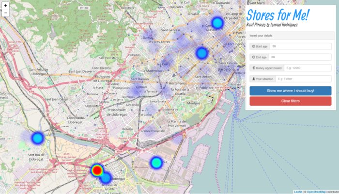

Heat map of bank transactions so a customer can see where people like him/her (age, salary,...) buys more frequently.

[View project](http://devpost.com/software/stores4me)

-----------

## Linked Data Hurricanes Info

**Java Spark, Javascript**

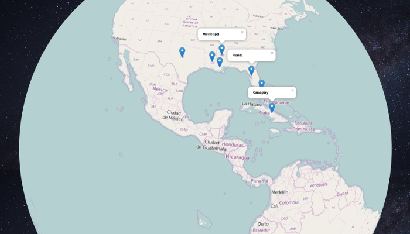

Web application that shows in an interactive map the zones affected by hurricanes. For that, it uses Open and Linked Data from DBPedia and Geonames.

[View project](https://github.com/borjaeg/keystone)

-----------

## Process Mining for Security

**Process Mining, Data Mining, Model Driven Software Engineering, Web Information Systems**

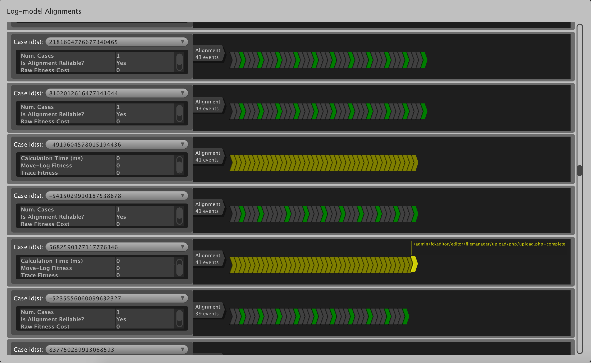

Approach for detecting new threats in Web information systems before they materialize and produce some kind of damage. This approach is based on process mining techniques and semiautomatic creation of formal models, from the diagrams produced during the design and development phases of the system to be protected and its log files.

[View project](http://sid.cps.unizar.es/PMS/)

-----------

## PocketShop

**Java, AngularJS + Ionic, Python**

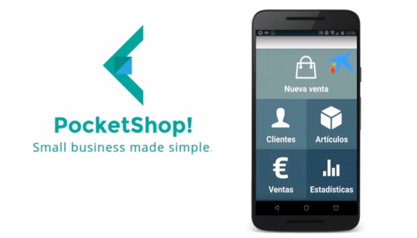

A solution for small business that provides a stock, client and sales management system, using a Raspberry Pi and one or more Android devices.

[View project](https://github.com/WallaTeam/FinApps15-App)

-----------

## JajaTweets

**NodeJS, Express, AngularJS, MongoDB**

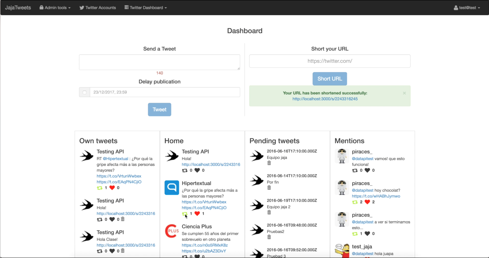

Web Social Managing tool for Twitter, where users can add and manage multiple Twitter accounts (including all Twitter actions available). Users can also visualize stats of their accounts, short URLs and subscribe to certain Hashtags, accounts and search terms.

[View project](https://github.com/piraces/JajaTweets)

-----------

## WallaLinks!

**Spring Framework (Java), ExpressJS, AngularJS, MongoDB**

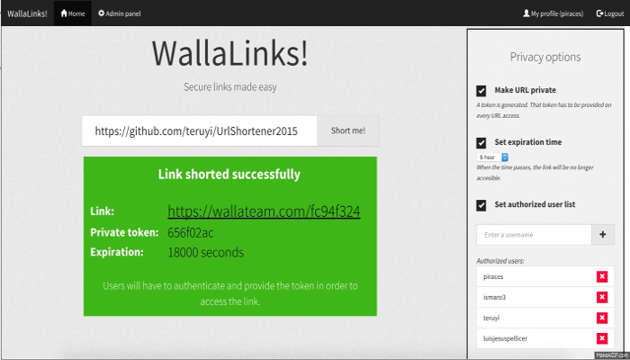

URL-Shortener web service and platform with advanced features like protected links, expiration, admin and user panel and stats.

[View project](https://github.com/WallaTeam/WallaLinks)

-----------

## WallaPet

**Android SDK, JavaEE**

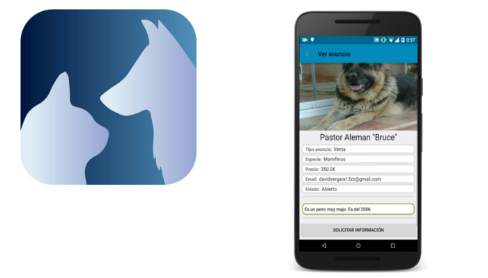

Android app for making simple deals between sellers/buyers of Animals and Animals in adoption.

[View project](https://github.com/WallaTeam/Wallapet)
